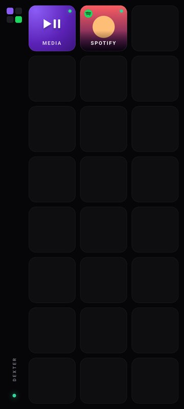
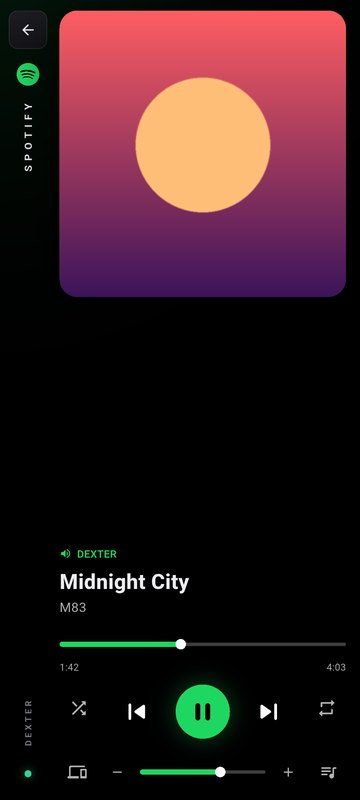
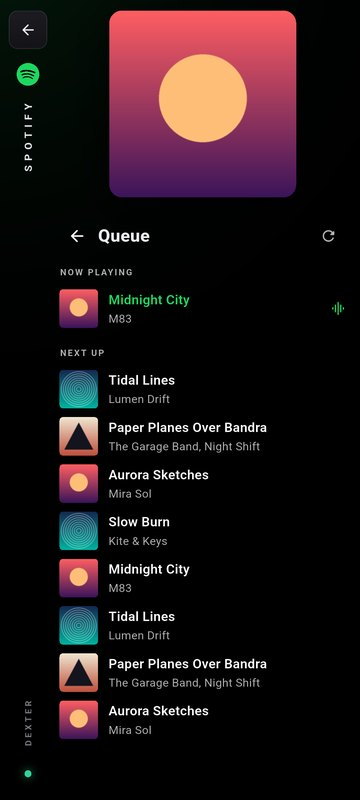
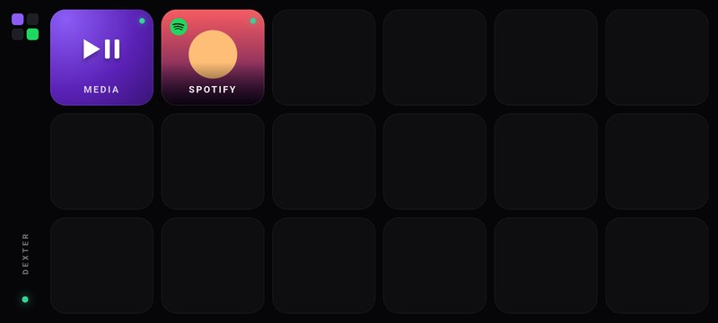
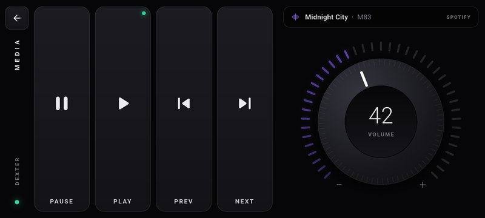
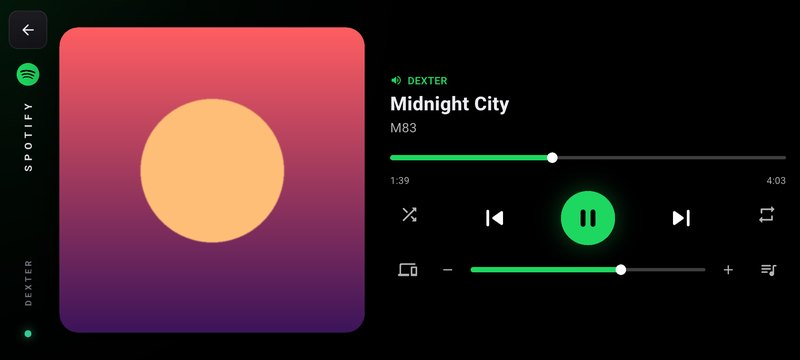

# Dacx

Turn your phone into a wireless Stream Deck for your PC: media keys, a volume knob and a full Spotify remote, all over your local WiFi.

No hardware. No cloud. No account.

<p>
  
  
  
</p>

---

## How it works

```
┌─────────────────┐          WiFi (LAN only)          ┌──────────────────────┐
│   Dacx Mobile   │ ◄──────── WebSocket ────────────► │   Dacx Desktop       │
│   (Flutter)     │            port 9876              │   (Python)           │
│                 │         nothing leaves            │                      │
│  tap keys       │            your router            │  controls your PC    │
└─────────────────┘                                   └──────────────────────┘
```

Both devices must be on the same WiFi. The desktop app shows a **6-digit pairing code** and a **QR code**. Scan it with the phone (or type the code) and the phone remembers the PC from then on.

---

## Mobile app

Built with **Flutter** for Android. It opens on a grid of keys like a real Stream Deck, **edge to edge**: everything that isn't a key (the logo, the page name, the PC's status) lives in a slim rail down the left side. The grid picks its rows and columns so keys stay close to square: **6 × 3 on a phone on its side, 3 × 8 upright**, more on a tablet, so the deck turns with the phone. Two keys are live today; the dark slots are ready for the next ones.



The keys show live state, the way Stream Deck plugins do: the Media key's light comes on while something plays on the PC, and the Spotify key shows the current album art.

### Media

Four tall keys (Pause, Play, Previous, Next) and a rotary **volume knob**. Turn the knob with a finger in a circle; the LED ring fills from − to +, the grip rotates with it, and the phone ticks under your thumb. Tap the centre cap to mute.



It drives whatever is playing on the PC (Spotify, a browser, VLC) through the Windows media session, so **Play and Pause are separate commands**, not one toggle. An LCD strip above the keys shows the title and the app it's coming from, and the Play or Pause key lights to show which state the PC is in.

### Dacx × Spotify

Black and green. Album art on one side; on the other, the song, a timeline you can scrub, shuffle / previous / play-pause / next / repeat, then devices, a volume slider and the queue.



- **Queue** and **Devices** swap in where the player was, with a back arrow. Upright, the art shrinks to make room for the list.
- Tap a device to move playback to it (your phone, a speaker, the PC).
- Taps update the screen at once and reconcile with Spotify a moment later, so nothing feels laggy. The timeline runs locally between polls.
- If Spotify isn't linked on the PC yet, or nothing is playing, the page says so and points at the fix.

### Staying connected

- Pairing is saved. The app reconnects on launch, when it returns to the foreground, and quietly in the background if the WiFi blinks. While it does, the rail's status light turns amber and the keys dim.
- A key tapped during a brief reconnect waits a few seconds for the link rather than failing.
- A 10 second heartbeat notices a dead connection before your next tap does.
- The screen stays awake and the system bars are hidden while Dacx is open, so it can sit on a stand next to the PC.

### Build and install

```bash
cd mobile
flutter pub get
flutter build apk --release --split-per-abi
# most phones: build/app/outputs/flutter-apk/app-arm64-v8a-release.apk (about 23 MB)
```

Run the tests with `flutter test`: 54 tests, covering QR and address parsing, the knob's "only the newest value" sender, the deck's grid maths, every screen at six phone and tablet sizes in both orientations (keys must reach the screen edges and stay near square), and the connection layer against a real local WebSocket server (pairing, wrong code, reply matching, reconnect, restore, a PC with a new code).

### Structure

```
mobile/lib/
├── main.dart               # App shell, immersive mode, pair ↔ deck switch, reconnect pill
├── link.dart               # WebSocket link: pairing, request ids, reconnect, saved PC
├── pacing.dart             # Poller (pauses in background) + LatestSender (knob/slider)
├── theme.dart              # Deck (violet) and Spotify (black & green) tokens
├── spotify.dart            # Spotify models + the drawn Spotify mark
├── screens/
│   ├── deck_screen.dart    # Edge-to-edge key grid, near-square keys, live key art
│   ├── media_screen.dart   # Media keys + knob
│   ├── spotify_screen.dart # Player, queue, devices
│   ├── pair_screen.dart    # Code entry
│   └── scan_screen.dart    # QR scanner
└── widgets/
    ├── side_rail.dart      # Left rail: logo or back, page name, PC status
    ├── deck_key.dart       # A key: tile or art face, status light, press
    └── volume_knob.dart    # Rotary knob with LED ring
```

---

## Desktop app

Built with **Python** + **CustomTkinter**. Runs on Windows.

### Setup

```bash
cd desktop
pip install -r requirements.txt
python main.py
```

### Structure

```
desktop/
├── main.py               # Entry point + command router
├── requirements.txt
└── dacx/
    ├── app_window.py     # CustomTkinter UI
    ├── ws_server.py      # asyncio WebSocket server (LAN)
    ├── actions.py        # Volume · Brightness · App launcher · Media keys
    ├── media_ctrl.py     # Windows media session: play, pause, now playing
    └── spotify_ctrl.py   # Spotify OAuth + playback, queue, devices
```

### Spotify setup

1. Go to [developer.spotify.com/dashboard](https://developer.spotify.com/dashboard)
2. Create an app and set the redirect URI to `http://localhost:8888/callback`
3. Copy the Client ID and Client Secret
4. Click **Connect** on the Spotify card in Dacx desktop and paste them in

Controlling playback through the Spotify Web API needs **Spotify Premium**.

---

## Protocol

JSON over a WebSocket on port 9876. The first message must pair:

```json
{"type": "auth", "code": "372231", "name": "Dacx Mobile"}
```

The PC answers `{"type": "auth_ok", "clientId": "…", "host": "DESKTOP-NAME"}`, or `auth_fail` and closes. After that, every command may carry an `"id"`, which comes back on its reply (`{"type": "result", …, "id": 7}` or `{"type": "error", "message": "…", "id": 7}`).

| `type` | `action` | Extra fields | Reply |
|---|---|---|---|
| `media` | `state` | | `volume`, `muted`, `session` (`app`, `title`, `artist`, `playing`) |
| `media` | `play` · `pause` · `play_pause` · `next` · `prev` | | `session` |
| `volume` | `set` · `up` · `down` · `mute` | `value` / `step` | `volume` or `muted` |
| `brightness` | `set` · `up` · `down` | `value` / `step` | `brightness` |
| `spotify` | `status` | | `authorized`, `spotify` (track, art, progress, shuffle, repeat, device…) |
| `spotify` | `play` · `pause` · `next` · `previous` | | `spotify` |
| `spotify` | `seek` · `volume` | `position` (ms) · `value` (0–100) | `spotify` |
| `spotify` | `shuffle` · `repeat` | `value`: `true/false` · `off/context/track` | `spotify` |
| `spotify` | `queue` · `devices` | | `current` + `queue` · `devices` |
| `spotify` | `transfer` | `deviceId` | `spotify` |
| `launch` | | `appId` | `launched` |

The QR code is `dacx://<ip>:<port>?code=<6 digits>`.

---

## Tech stack

| Layer | Technology |
|---|---|
| Mobile | Flutter 3.38 · Dart · web_socket_channel · mobile_scanner · shared_preferences |
| Desktop UI | Python · CustomTkinter |
| Desktop system actions | pycaw · screen-brightness-control · ctypes |
| Media session | Windows GlobalSystemMediaTransportControls via pywinrt |
| Transport | asyncio WebSocket (`websockets`) |
| Spotify | spotipy · Spotify Web API |
| Pairing | 6-digit local code + QR (LAN only) |

---

## Known limits

- The desktop makes a new pairing code each time it starts, so after a PC restart the phone asks you to scan again.
- The Spotify queue is read-only: the Web API can't jump to a queued song.
- Android only for now.

---

## Privacy

- Nothing is sent anywhere except Spotify's own API (for Spotify control) and Spotify's image CDN (album art on the phone)
- The pairing code, QR code and every command stay on your network
- No accounts, no sign-up, no telemetry
